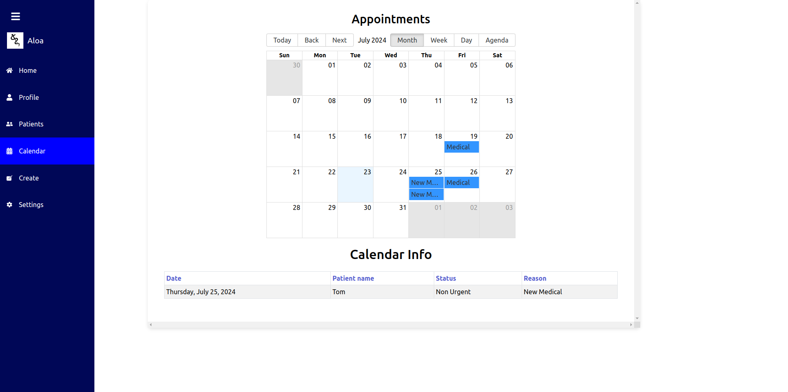

# EHR Medical Records System

This Electronic Health Record (EHR) system is designed to streamline the management of patient records, appointments, and other crucial information for healthcare providers. Here's a brief overview of what you'll find in this application:

## Home Page

The Home Page serves as the main dashboard, giving you a quick overview of your activities and navigation to other sections.

## User Info Page

### Login Page

### Signup Page

### Profile Page

Here you can view and manage your personal and professional information.

## Patients Page

Access and manage patient records and information if you are a doctor.

## Calendar Page

Manage and view your appointments as a doctor.

## Settings Page

Customize various settings for the EHR system according to your preferences.

## Create Patients and Appointments

### Create Appointment Page

### Create Medical Record Page

### Failed Create Medical Record

Add new patient records and schedule appointments efficiently.

## Stack Used: MERN

To run the application, follow these steps:

1. Install the required dependencies with `npm install`.
2. Run the application with `npm start`.

Note: You need to setup the config file in the backend and create a cluster with MongoDB.